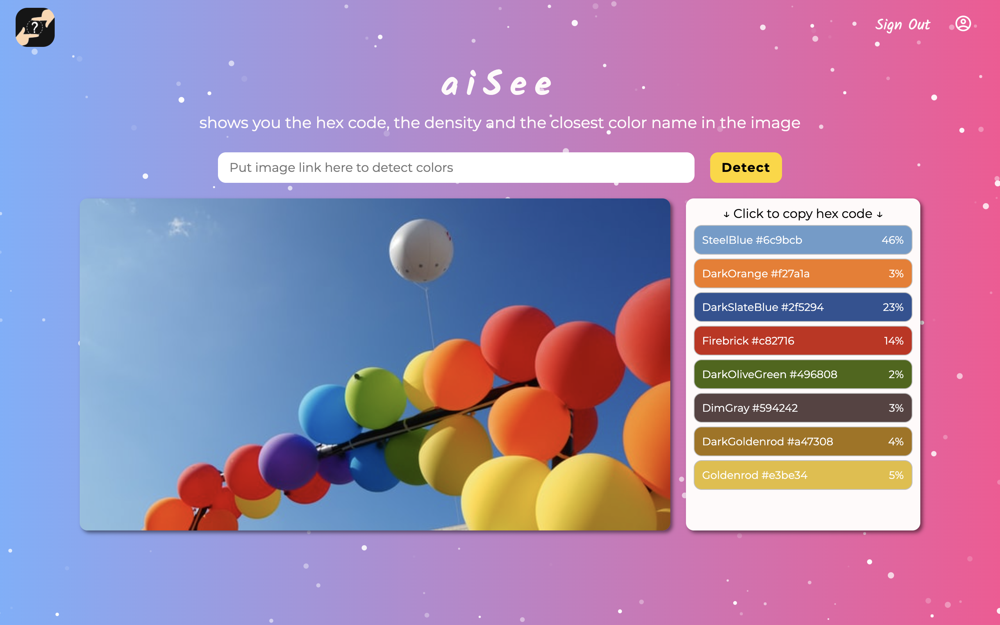

# aiSee

A full-stack color detection app that shows the hex code, density and the closest W3C color name for each identified color in an image.

## Core Features
- Input image url to detect color
- Detect colors in an image and show hex code and density of the color and the closest W3C color name for each identified color.
- Save image url and color information to database
- Show submit history and result of detection in user's dashboard

## Languages
- JavaScript
- CSS3
- HTML5

## Technologies
- Front End
  - React (w/ Hooks, Router)
  - Redux
  - styled-components

- [Back End](https://github.com/ShaineTsou/aisee-api)
  - Node.js
  - Express.js
  - [Knex.js](https://knexjs.org/)
  - PostgreSQL
  - [Clarifai API](https://www.clarifai.com/)

## Deployment
- Front End: GitHub Pages
- [Back End](https://github.com/ShaineTsou/aisee-api): Heroku